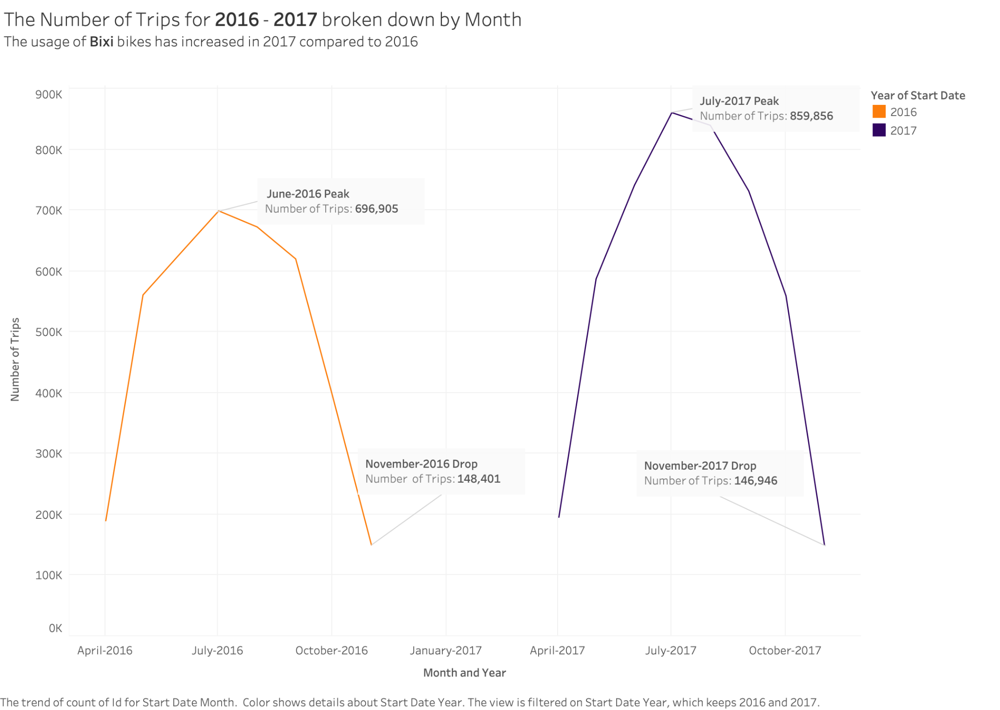
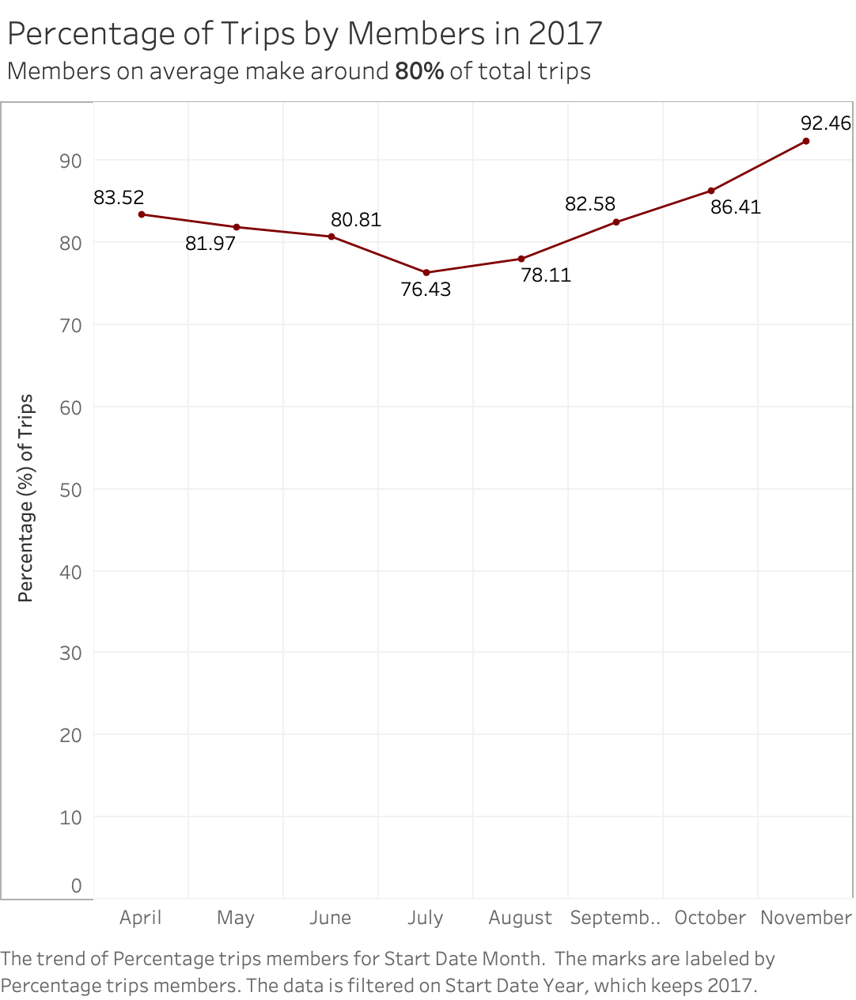
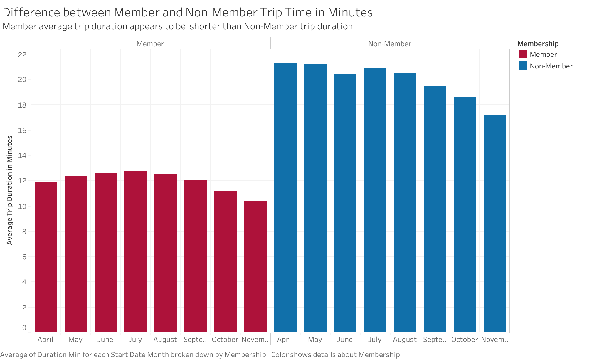
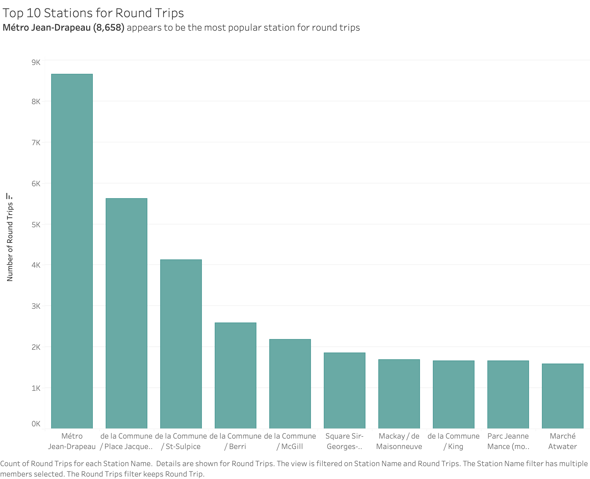
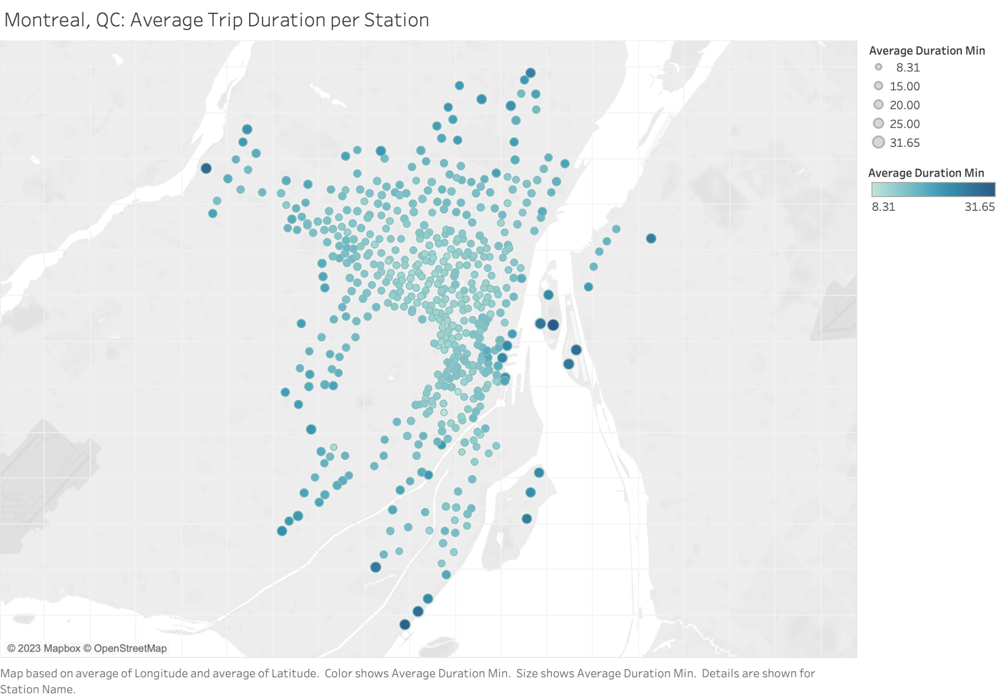
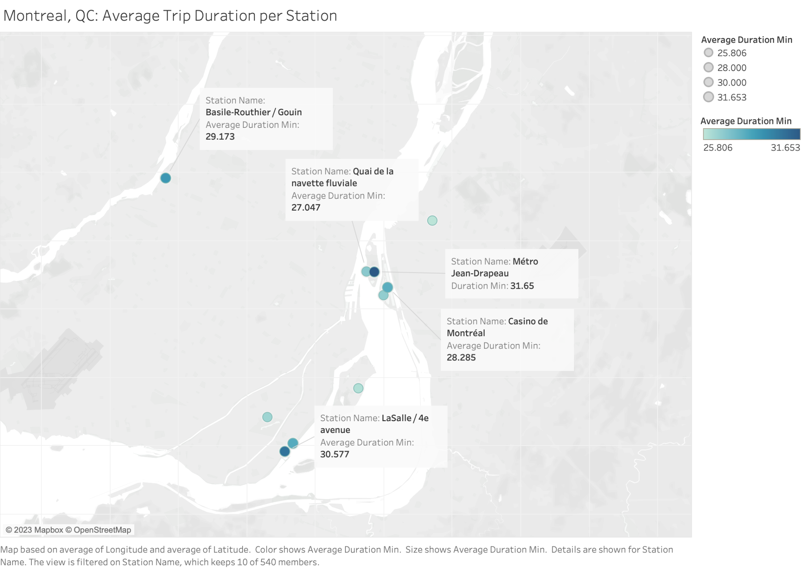
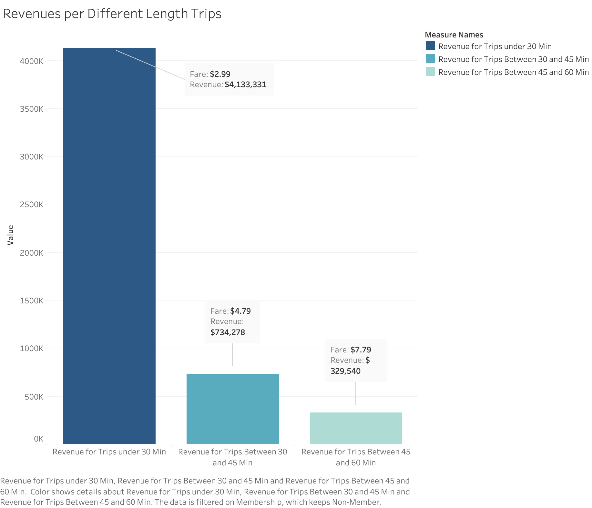

# Montreal BIXI Bike Share — SQL Analysis & Tableau Reporting

Analysis of ~8.6M bike-share trips from Bixi Montréal (2016–2017) examening ridership growth, membership segmentation, demand per station, and casual-user revenue.

**Tools:** MySQL 8.0 · Tableau Desktop

---

## Headline findings

| Question | Finding |
|---|---|
| Is ridership growing? | Yes — every month grew year over year except November. July 2017 peaked at 859,856 trips vs. 696,905 in July 2016 (**+23%**). |
| Who rides? | Members take **~80%** of all 2017 trips, but their share is seasonal: 76% in July, 92% in November. |
| Do the segments differ? | Members average spend ~12 min per trip; casual users ~20 min, which is consistent with commuting vs. leisure use. |
| Where is demand concentrated? | Métro Jean-Drapeau leads round trips (**8,658**) and the longest average duration (**31.7 min**) — an island park destination, not a commuter node. |
| Where does casual revenue come from? | 30-minute trips generate **$4.13M** of modelled casual revenue, ~80% of the total. Peak is Sunday 3 PM ($80,273). |

---

## Ridership growth, 2016 → 2017

## Membership

## Station demand

## Casual-user revenue

---

## SQL techniques

- **Window functions** — `LAG` for year-over-year comparison, `SUM() OVER (PARTITION BY)`
  for within-year percentage shares, `ROW_NUMBER` for per-group top-N, running
  totals for cumulative demand concentration
- **CTEs** for multi-step aggregation without repeating subqueries
- **Conditional aggregation** to pivot time-of-day buckets into columns
- **`CREATE TABLE AS SELECT`** so derived tables stay reproducible
- **Index design** driven by the actual query predicates, with a covering index
  for the month/membership aggregations
- **Data-quality gates** — orphaned foreign keys, negative and outlier durations
  checked before any figure is reported

## Data

Bixi publishes historical trip data as open data. See [`data/README.md`](data/README.md).
CSVs are gitignored — the repo ships the schema and queries, not the ~1GB of source rows.
