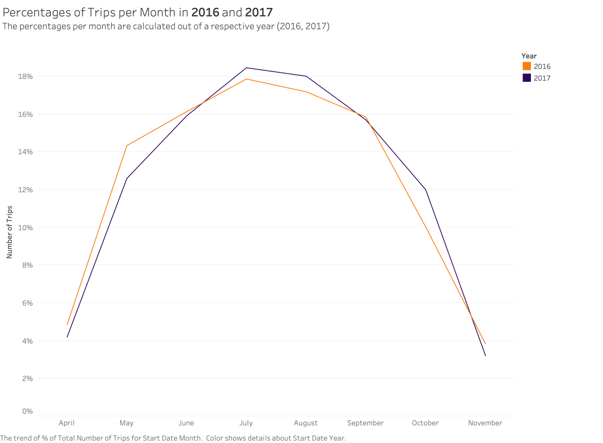

# Bixi Bike Share — SQL Analysis & Tableau Reporting

Analysis of ~8.6M bike-share trips from Bixi Montréal (2016–2017), built to answer
a stakeholder brief from the BI Manager, marketing team, and Director of Finance.

**Stack:** MySQL 8.0 · Tableau Desktop
**Scope:** ridership growth, membership segmentation, station-level demand, casual-user revenue

---

## Headline findings

| Question | Finding |
|---|---|
| Is ridership growing? | Yes — every month grew year over year except November. July 2017 peaked at 859,856 trips vs. 696,905 in July 2016 (**+23%**). |
| Who rides? | Members take **~80%** of all 2017 trips, but their share swings seasonally: 76% in July, 92% in November. |
| Do the segments differ? | Members average ~12 min per trip; casual users ~20 min. Consistent with commuting vs. leisure use. |
| Where is demand concentrated? | Métro Jean-Drapeau leads round trips (**8,658**) and the longest average duration (**31.7 min**) — an island park destination, not a commuter node. |
| Where does casual revenue come from? | Sub-30-minute trips generate **$4.13M** of modelled casual revenue, ~80% of the total. Peak is Sunday 3 PM ($80,273). |

The seasonal member-share swing is the finding I'd lead with in a stakeholder
conversation. The headline "80% members" is an annual average that conceals the
real pattern: casual riders are a summer phenomenon, so any acquisition campaign
aimed at converting them has a narrow window and should run in June–August.

---

## Ridership growth, 2016 → 2017


Normalising each month against its own year's total shows the seasonal *shape*
is nearly identical across both years — the growth is a level shift, not a
change in rider behaviour.



## Membership


## Station demand


## Casual-user revenue


---

## Repository structure

```
├── sql/
│   ├── 00_setup.sql              Schema, load, indexing, data-quality checks
│   ├── 01_ridership_volume.sql   Trip counts, YoY change, seasonality
│   ├── 02_membership.sql         Member vs. casual segmentation
│   ├── 03_stations.sql           Station ranking, time-of-day flow
│   ├── 04_round_trips.sql        Round-trip rates and leisure signal
│   └── 05_revenue.sql            Fare model and revenue by band/hour
├── tableau/
│   ├── bixi_tableau_report.pdf   Full written report
│   └── screenshots/              Individual dashboard exports
├── docs/
│   └── methodology.md            Assumptions, caveats, known limitations
└── data/
    └── README.md                 How to obtain the source data
```

## Running it

```bash
mysql -u root -p < sql/00_setup.sql     # creates schema + indexes
# uncomment the LOAD DATA blocks in 00_setup.sql after placing CSVs in data/
mysql -u root -p bixi < sql/01_ridership_volume.sql
```

Each file after `00_setup.sql` is independent and can be run on its own.

---

## SQL techniques demonstrated

- **Window functions** — `LAG` for year-over-year comparison, `SUM() OVER (PARTITION BY)`
  for within-year percentage shares, `ROW_NUMBER` for per-group top-N, running
  totals for cumulative demand concentration
- **CTEs** for multi-step aggregation without repeating subqueries
- **Conditional aggregation** to pivot time-of-day buckets into columns
- **`CREATE TABLE AS SELECT`** so derived tables stay reproducible
- **Index design** driven by the actual query predicates, with a covering index
  for the month/membership aggregations
- **Data-quality gates** — orphaned foreign keys, negative and outlier durations
  checked before any figure is reported

## Notes on the refactor

This repo is a rebuild of a course deliverable. The analysis and conclusions are
the original ones; the SQL has been reworked, and the changes are the part worth
reading:

| Original | Change | Why |
|---|---|---|
| `INSERT INTO working_table1 VALUES ('Apr, 2016', 11870.19), ...` | `CREATE TABLE AS SELECT` | Sixteen hand-pasted results go stale the moment data changes and can't be re-run |
| `WHERE YEAR(start_date) = '2016'` | Half-open date range | Function on the column blocks index use; also compared a date part to a string |
| `BETWEEN '2016-01-01' AND '2016-12-31'` | `>= ... < '2017-01-01'` | On a `DATETIME`, `BETWEEN` silently drops everything after midnight on Dec 31 |
| Monthly counts with no year/month in `SELECT` | Grouping keys projected | Output rows were unlabelled and unusable downstream |
| Six near-identical Namur queries, results in comments | One conditional aggregation | Same information, one result set, plus the net-flow column that answers the question |
| Arrival buckets keyed on `HOUR(start_date)` | Keyed on `HOUR(end_date)` | An arrival was being bucketed by its departure time |
| `RIGHT JOIN` with `stations` on the left | `INNER JOIN` / explicit `LEFT JOIN` | The join direction contradicted the grouping and collapsed unmatched rows into a NULL bucket |
| `HAVING pct_round_trips >= 10` | Filter in outer query | Alias in `HAVING` is a MySQL extension; breaks on Postgres and SQL Server |

Two analyses were added that the original didn't cover: a median alongside the
mean trip duration (duration is right-skewed, so the mean overstates the
member/casual gap), and a direct test of the report's own leisure interpretation
of round trips against weekend share and casual-user share.

## Limitations

The revenue model multiplies trip counts by single-trip fares. Real casual
revenue includes day passes and multi-trip products, so a rider taking four
trips is counted four times here but paid once. These figures are an upper bound
on casual revenue and a sound guide to *relative* demand across bands and hours —
not booked revenue. Full assumptions in [`docs/methodology.md`](docs/methodology.md).

## Data

Bixi publishes historical trip data as open data. See [`data/README.md`](data/README.md).
CSVs are gitignored — the repo ships the schema and queries, not the ~1GB of source rows.
